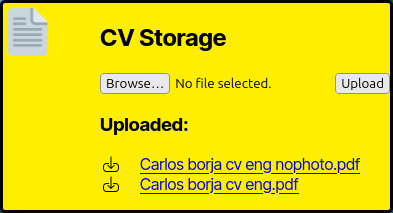

# this.empleo &middot; [](https://github.com/facebook/react/blob/main/LICENSE)

## Features

this.empleo is designed to facilitate job searches by providing an access-from-anywhere dashboard where you can keep job-seeking data.

### Google accounts integration


Cards, CVs and cover letters provided to this.empleo are uploaded to firebase, accessible from any device with an internet connection.

### CV Storage



Upload and download up to 3 CVs, ready to be shared with anyone.

### Links handlers and management


Store the query links from job-seeking platforms in one place, ready to be used.

Save offers for later or keep track of those you've applied to, complete with a time tracking system.

### Cover letter storage

Save up to 5 different cover letters, easily copypastable anytime.

## Dev

### Setting Up Firebase for Development

To contribute to or boot this project, you'll need to set up your own Firebase configuration. Follow these steps:

1. Create a Firebase Project

Go to Firebase Console: https://console.firebase.google.com/

Click on Add Project and follow the setup instructions.

Once your project is created, navigate to Project Settings.

2. Get Firebase Config Values

In Project Settings, go to the General tab.

Under Your apps, click Add app and select Web.

Register the app (you don't need to enable Firebase Hosting for development).

Firebase will provide you with a configuration object that looks like this:

{
  "apiKey": "YOUR_API_KEY",
  "authDomain": "YOUR_AUTH_DOMAIN",
  "projectId": "YOUR_PROJECT_ID",
  "storageBucket": "YOUR_STORAGE_BUCKET",
  "messagingSenderId": "YOUR_MESSAGING_SENDER_ID",
  "appId": "YOUR_APP_ID"
}

3. Set Up Environment Variables

In the project's root directory, create a .env file.

Add the following environment variables, replacing the placeholders with your actual Firebase config values:

VITE_FIREBASE_API_KEY=YOUR_API_KEY
VITE_FIREBASE_AUTH_DOMAIN=YOUR_AUTH_DOMAIN
VITE_FIREBASE_PROJECT_ID=YOUR_PROJECT_ID
VITE_FIREBASE_STORAGE_BUCKET=YOUR_STORAGE_BUCKET
VITE_FIREBASE_MESSAGING_SENDER_ID=YOUR_MESSAGING_SENDER_ID
VITE_FIREBASE_APP_ID=YOUR_APP_ID

4. Enable Blaze Plan (If Needed for Storage)

By default, Firebase's free plan (Spark) has limitations on storage access depending on the region. If you need full storage functionality, you may have to upgrade to the Blaze plan:

Go to Firebase Console.

Navigate to Billing and select the Blaze Plan. Note that the free tier included in the blaze plan ought to be more than enough.

Ensure that Cloud Storage is properly configured under Build > Storage.

Set up appropriate storage rules in Storage > Rules to match your development needs.

5. Configuring CORS for Firebase Storage

If you're using Firebase Storage and need to configure Cross-Origin Resource Sharing (CORS), follow these steps:

- Ensure you have the **Google Cloud SDK** installed with `gsutil` available.
- Authenticate with Google Cloud using:
  
  ```sh
  gcloud auth login
  ```
  
- Set your project to the correct Firebase project ID:
  
  ```sh
  gcloud config set project your-project-id
  ```
  
  Replace `your-project-id` with your actual Firebase project ID.

## Creating and Applying CORS Configuration

**Create a `cors.json` file** in your project directory with the following content:

   ```json
   [
     {
       "origin": ["*"],
       "responseHeader": ["Content-Type"],
       "method": ["GET", "POST", "PUT"],
       "maxAgeSeconds": 3600
     }
   ]
   ```

   Modify the values as needed for your security requirements.

**Apply the CORS settings to your Firebase Storage bucket**:

   First, ensure you are in the directory where `cors.json` is located. Then run:

   ```sh
   gsutil cors set cors.json gs://your-project-id
   ```

   Replace `your-project-id` with your actual Firebase Storage bucket name. Typically, it is just your Firebase project ID (e.g., `gs://thisempleo`).

## Verifying CORS Configuration

After applying the CORS settings, you can verify them with:

```sh
gsutil cors get gs://your-project-id
```

This should return the CORS rules currently applied to the bucket.

## Troubleshooting

- If you get **"No such file or directory"**, ensure `cors.json` exists in the directory where you're running the command.
- If you get **"Access Denied"**, check that you're authenticated and have the correct permissions for Firebase Storage.
- If your frontend is still facing CORS issues, try clearing the cache or running the browser in incognito mode.

---
This should help set up and manage CORS for Firebase Storage efficiently! 🚀


6. Install Dependencies and Run the Project

Install dependencies:

npm install

Start the development server: